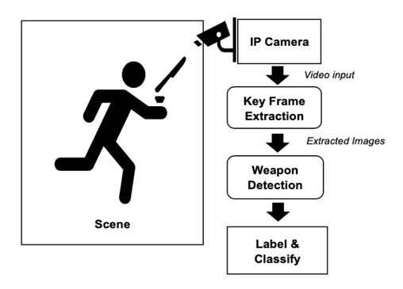

# Overview
Automatic Detection and Recognition of Weapons in Surveillance Videos Using AI-Based System.


# Abstract
Security cameras and video surveillance systems play a crucial role in ensuring public safety. However, in many cities, the detection of high-risk situations through these systems is still done manually. The shortage of manpower in the security sector and human limitations can lead to undetected dangers or delays in identifying threats, posing risks to the public. In response, various parties have developed real-time and automated solutions for identifying risks in surveillance videos. This project focuses on developing a cost-effective and efficient AI-based solution for real-time weapon detection and recognition in surveillance videos across different scenarios. The system is built using TensorFlow and has been tested with a 294-second video containing seven weapons from five categories: handgun, shotgun, automatic rifle, sniper rifle, and submachine gun. At an intersection over union (IoU) value of 0.50 and 0.75, the system achieved precision scores of 0.8524 and 0.7006, respectively.

# Table of Contents
* [Introduction](#Introduction)
* [System](#System)
* [Methodologies](#Methodologies)
* [Environment](#Environment)
* [Usage](#Usage)
* [Results](#Results)

# Introduction
Artificial intelligence has become an integral part of our daily lives, with applications ranging from AlphaGo to facial recognition for payments, drones, and autonomous vehicles. However, traditional security methods are often inadequate in addressing the security risks posed by technological advancements. This project leverages artificial intelligence to enhance security by automatically detecting and recognizing firearms, knives, and other weapons in streaming videos captured by surveillance cameras in Hong Kong, where the prevalence of surveillance cameras is high.

# System
The system comprises several functional blocks, as depicted in the figure below. After the surveillance camera captures a video, it undergoes keyframe extraction to reduce data size for real-time processing. Extracted frames are then fed into the weapon detection algorithm, which classifies and labels the detected weapons.



The system operates in two modes:
1. **Energy-saving mode**: Detects weapons only when the content of the surveillance video changes, reducing computational resource usage. Suitable for low-traffic or low-security areas.
2. **High-performance mode**: Provides the highest level of security by detecting weapons frame-by-frame in densely populated or high-security risk areas.

# Methodologies
## Key Frame Extraction
To enhance efficiency, keyframes are extracted from surveillance videos. Keyframes represent frames where significant scene changes occur. This reduces the computational burden associated with analyzing every frame.

Keyframe extraction is based on interframe differences. When there are no moving objects in the scene, consecutive frames exhibit minimal changes. In contrast, moving objects cause substantial differences between successive frames. These interframe differences are used to identify keyframes.

## Weapons Detection and Recognition
The system is built on TensorFlow and uses the Single Shot MultiBox Detector (SSD) with MobileNet as the feature extractor for object prediction. The process involves the following steps:
1. Dataset creation: A dataset is created using images from the COCO dataset for each weapon category.
2. Manual labeling: The training images are manually labeled using the "LabelImg" software, generating XML files describing the objects in the images.
3. Data preparation: XML files are converted into CSV files and then into TFRecord files.
4. Model configuration: The model's configuration file is set up, specifying parameters such as the number of classes (weapons categories).
5. Model training: The model is trained using the TFRecord files and the configuration file.
6. Model testing: After training, the model can be tested on images or videos.

# Environment
The software environment used for developing the system is summarized in the table below:

| Name               | Version                  |
|--------------------|--------------------------|
| Operating System   | Microsoft Windows 10 (64-bit) |
| Python             | 3.7.3                    |
| TensorFlow         | 1.14.0                   |
| Graphics Driver    | Radeon Software Adrenalin 19.20 |
| Conda              | 4.7.12                   |

# Usage
## Create Training/Test Datasets
1. Use keyframe-extracted images as training and test data.
2. Label training images using "LabelImg" and create XML files for object descriptions.
3. Convert XML files to CSV files.
4. Generate TFRecord files from the CSV files.
5. Create a label map file specifying weapon names and IDs.
6. Modify the model configuration file with the number of classes and set batch sizes as needed.

## Training the Model
Train the model using TensorFlow's `model_main.py` script. Set the number of training and evaluation steps as desired. For example:
```bash
python object_detection/model_main.py \
       --pipeline_config_path=object_detection/training2/ssd_mobilenet_v1_coco.config \
       --model_dir=object_detection/training2 \
       --num_train_steps=200000 \
       --num_eval_steps=6000 \
       --alsologtostderr
```

## Testing the Model
After training, export the inference graph using the `export_inference_graph.py` script. Specify the checkpoint number corresponding to your trained model.
```bash
python export_inference_graph.py \
       --input_type image_tensor \
       --pipeline_config_path training/ssd_mobilenet_v1_coco.config \
       --trained_checkpoint_prefix training/model.ckpt-200000 \
       --output_directory weapon_detection
```

## Real-time Detection
Perform real-time weapon detection using the exported model with the provided Python scripts: [gun_image_testing](https://github.com/RunzeXU/AI-detection-weapons/blob/master/gun_image_test.py) and [gun_video_testing](https://github.com/RunzeXU/AI-detection-weapons/blob/master/gun_video_testing.py).

# Results
The system achieved efficient real-time detection and recognition of weapons within six categories, including handguns, shotguns, automatic rifles, sniper rifles, knives, and submachine guns. At an intersection over union (IoU) value of 0.50 and 0.75, the system demonstrated precision scores of 0.8524 and 0.7006, respectively. The system operates in both energy-saving and high-performance modes to suit different surveillance scenarios.
